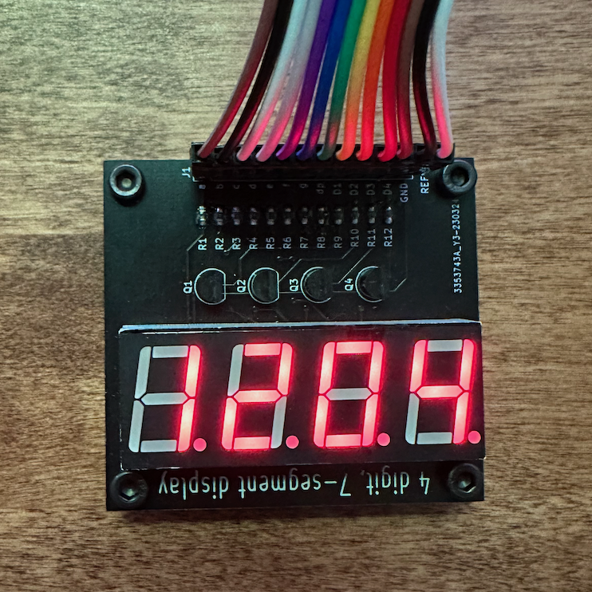
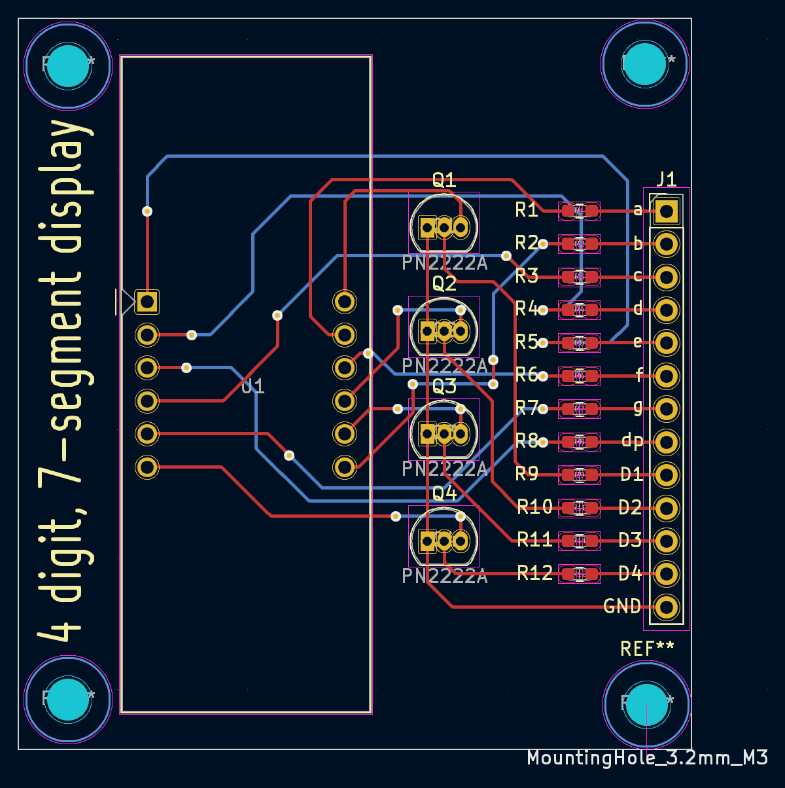

# 4 Digit, 7-Segment Breakout FPGA

This breakout board was created to be used in my Ohio University Master's course. We were required to build this circuit on a breadboard but I wanted to help develop my PCB design skills. This is a 2 layer board and has 4 M3 mounting holes to add standoffs. This was designed using KiCAD and the PCB was produced by JLCPCB.

## Table of Contents
- [4 Digit, 7-Segment Breakout FPGA](#4-digit-7-segment-breakout-fpga)
  - [Table of Contents](#table-of-contents)
  - [BOM](#bom)
  - [Usage](#usage)
  - [License](#license)

## BOM
| Qty           | Reference     | Value         |
| ------------- | ------------- | ------------- |
| 1 | U1 | 4 Digit, 7-Segment Display |
| 1 | J1 | 1x13 2.54mm Header |
| 8 | R1-R8| 330&#937; (0603)
| 4 | R9-R12| 10k&#937; (0603)
| 4 | Q1-Q4| PN2222A (TO-92)
## Usage
## License
